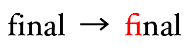

# iconfont的一个使用方式  
相关文件：    

```
@font-face {
  font-family: 'Material Icons';
  font-style: normal;
  font-weight: 400;
  src: local('Material Icons'), local('MaterialIcons-Regular'), url(https://fonts.gstatic.com/s/materialicons/v7/2fcrYFNaTjcS6g4U3t-Y5ZjZjT5FdEJ140U2DJYC3mY.woff2) format('woff2');
}

.material-icons {
  font-family: 'Material Icons';
  font-weight: normal;
  font-style: normal;
  font-size: 24px;
  line-height: 1;
  text-transform: none;
  display: inline-block;
  -webkit-font-feature-settings: 'liga';
  -webkit-font-smoothing: antialiased;
}
```
其实最重要的是`font-family: 'Material Icons';`和`-webkit-font-feature-settings: 'liga';`，前者声明了使用Material Icons作为字体，后者则启用了连字特性。  

  
注意，由于启用了连字特性，所以针对输入`fi`不再分别输出`f`和`i`的字形，而是输出fi的连字字形。

其实Material Font就利用了连字特性，来达到让这个输入：  
```
<i class="md-icon dp48">flip_to_front</i>
```   
映射到这个输出:   
   

一般而言，为了兼容字符输出和icon font输出，icon font会选择映射unicode表上面不被占用的一个平面的单字（如font awesome），这样做的坏处是我们不知道什么输入对应输出，根本没有办法记忆和直观地查找。
但使用了连字特性，我们针对形如`flip_to_front`的连字进行映射，它很直观，也很好记。
