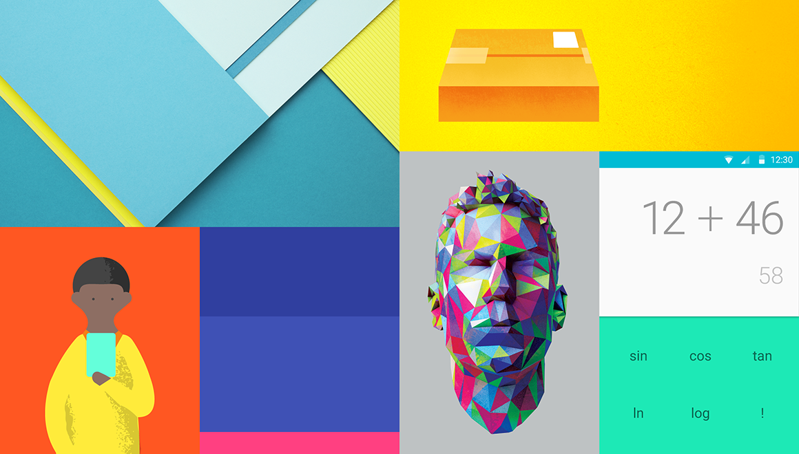

---
layout: post
title: 使用Github Pages建独立博客
description: Github本身就是不错的代码社区，他也提供了一些其他的服务，比如Github Pages，使用它可以很方便的建立自己的独立博客，并且免费。
category: coding
---

# 帮你全面彻底搞定MATERIAL DESIGN  

自从Material design发布以来，happyze就在一直收集相关素材与资源，研究别人的作品。这套设计风格非常鲜明，带有浓郁的Google式严谨和理性哲学，深得我心。实际上，光是研究素材和别人作品，就能发现一些明显的规律，做出几分相似的设计。这样半吊子的状态一直保持到现在，最近有时间通读一遍官方的设计指南，终于有了深入的理解。  

   

Material design的设计规范细致入微，需要消化好一阵子。越读越感受到它的妙处，假如每个细节都严格遵照Material design的思想来设计，哪怕你不是设计人员，你的产品也一定不会难用和难看。当然，作为设计师，要求就更高了。设计文档本身，就提供了一种很好的方式，帮你从各个角度思考和构建自己产品的规范。但在这之前，先要好好整理一下学习笔记。要打破规矩，必先掌握规矩。

由于只是笔记，我会写得尽量简单。并且省略掉一些可乐橙认为设计师都已经掌握的信息。想要深入了解Material design，还是建议有空通读一遍官方文档。不过，牢记以下要点，基本能做到90%了。实际上，Google官方的应用也有不遵照规范的地方，不能太拘泥于条条框框。  

### 一、核心思想  

aterial design的核心思想，就是把物理世界的体验带进屏幕。去掉现实中的杂质和随机性，保留其最原始纯净的形态、空间关系、变化与过渡，配合虚拟世界的灵活特性，还原最贴近真实的体验，达到简洁与直观的效果。  

  

### 二、材质

材质  

    

Material design中，最重要的信息载体就是魔法纸片。纸片层叠、合并、分离，拥有现实中的厚度、惯性和反馈，同时拥有液体的一些特性，能够自由伸展变形。

### 三、动画  

Material design重视动画效果，它反复强调一点：动画不只是装饰，它有含义，能表达元素、界面之间的关系，具备功能上的作用。  

easing  

   

动画要贴近真实世界，就要重视easing。物理世界中的运动和变化都是有加速和减速过程的，忽然开始、忽然停止的匀速动画显得机械而不真实。考虑动画的easing，要先考虑它在现实世界中的运动规律。

水波反馈

        

   
