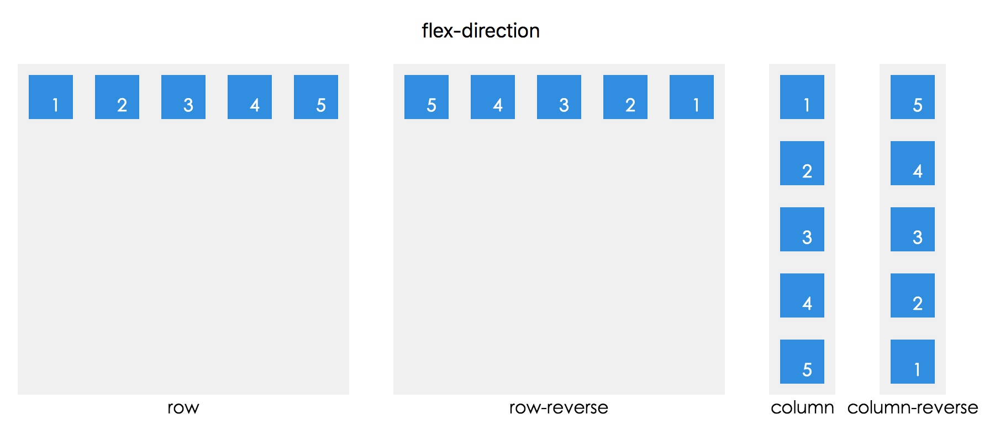
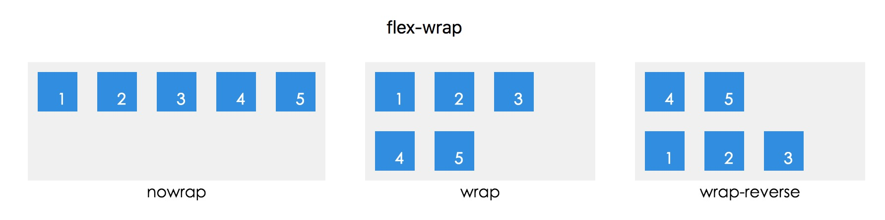
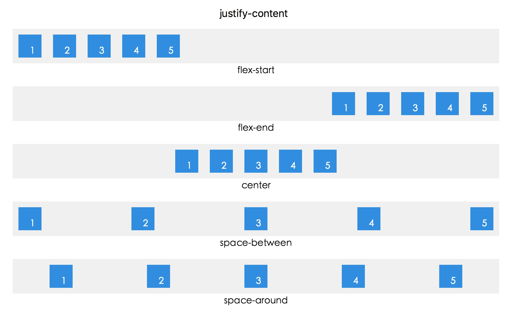
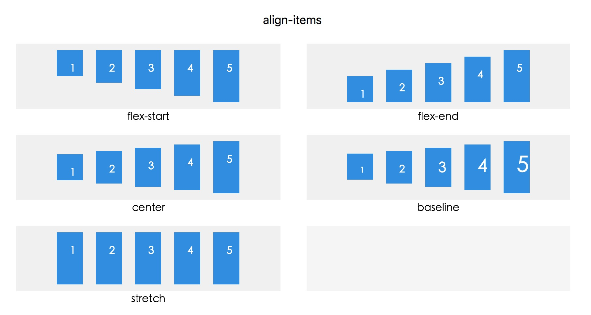
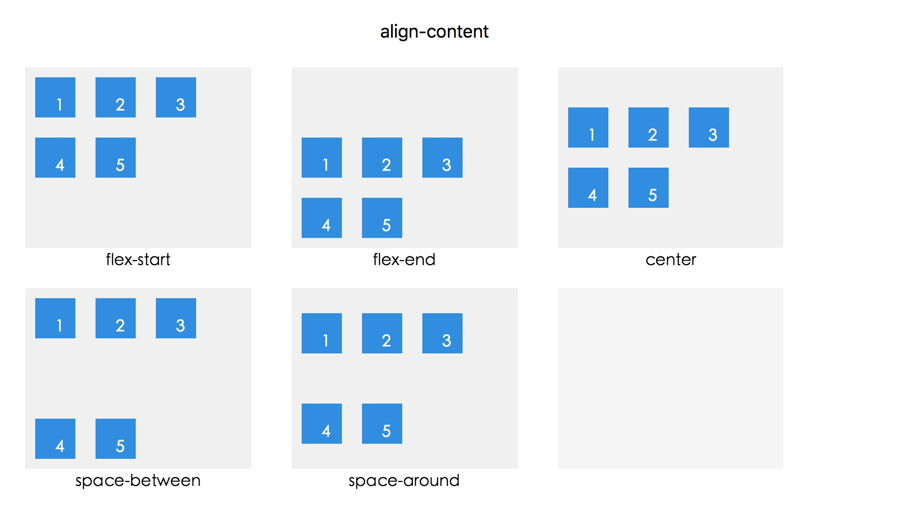
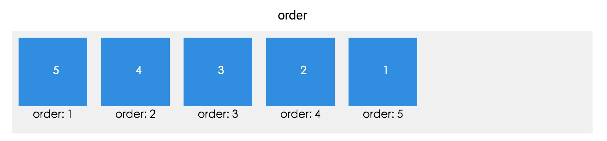
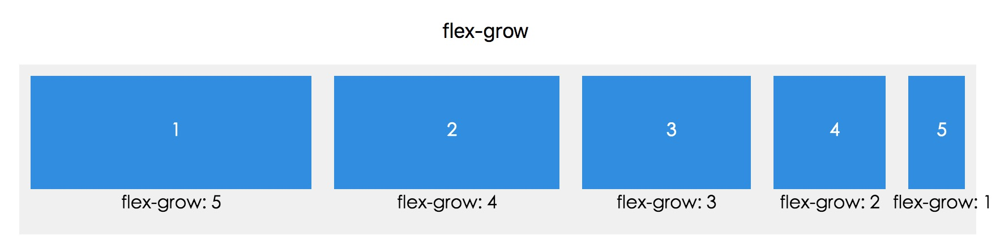
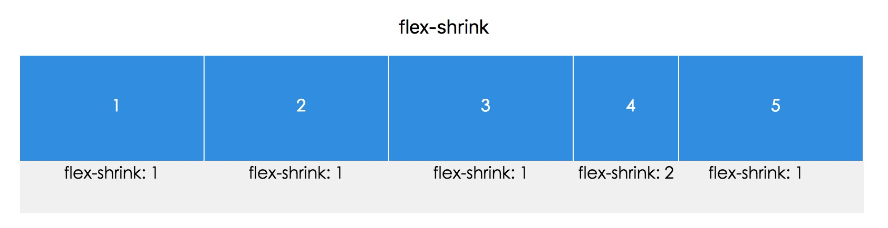
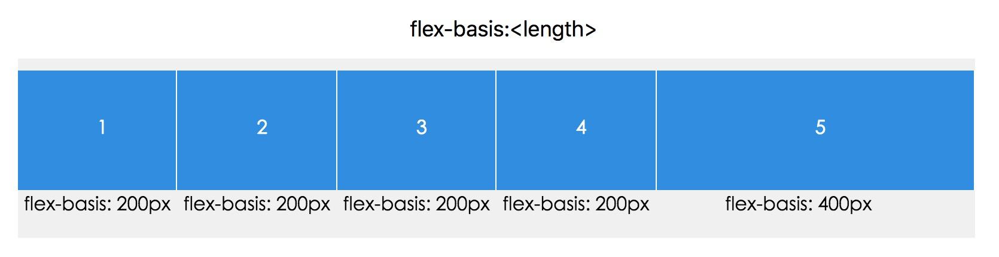
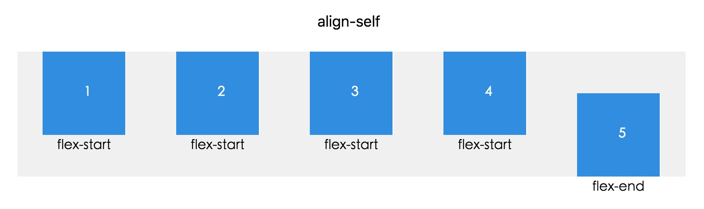

### 一、flexbox是什么？  

从字面上来看，flexbox是可伸缩的盒子的意思。我们可以让这个盒子里的子项，根据我们的需要拉伸、对齐、排序。设置父元素为flexbox，即可激活这个弹性机制。方法如下：  

首先我们来设置html   

```
<div class="parent">
    <div class="child"></div>
    <div class="child"></div>
    <div class="child"></div>
</div>
```  
接下来设置css  
```
.parent {
    display:flex; // 类似display:block的flexbox
}
```
或者  
```
.parent {
    display:inline-flex; // 类似display:inline-block的flexbox
}
```  

### 二、属性太多很难记？

和flexbox相关的属性繁多，每个属性又有不同的值，要一时半会全部记住是不太可能，但是我们可以分类记忆，在脑中有印象后在使用时勤查文档，相信要熟练应用还是会很快的。记忆flexbox只需要记住两点：

  * 所有的属性分为两类：父容器的属性和子项的属性
  * 所有的属性值几乎都和排列、对齐、占地面积3类特性相关  

父容器属性  

属性  作用  特性  分类  


* flex-direction  定义子项在容器内的排列方向  排列
* flex-wrap      定义子项在容器内的换行效果  排列
* flex-flow  flex-direction和flex-wrap的复合属性  排列
* justify-content  定义子项在容器内水平对齐方式  对齐
* align-items  定义子项在容器内垂直对齐方式  对齐
* align-content  定义多行子项在容器内整体垂直对齐方式  对齐    


子项属性  

* 属性	作用	特性分类  


* order	定义子项们的排列顺序	排列
* flex-grow	定义子项宽度之和不足父元素宽度时，子项拉伸的比例	占地面积
* flex-shrink	定义子项宽度之和超过父元素宽度时，子项缩放的比例	占地面积
* flex-basis	定义子项的初始宽度，若子项宽度之和超过父元素宽度时，子项按照flex-basis的比例缩放	占地面积
* align-self	定义单个子项与其他项目不一样的对齐方式	对齐  

### 三、图解父容器的属性

我们逐一来看看效果，先来看看父元素的属性（不要忘了我们已经在父元素上加上了display:flex哦，下面为了更直观对比隐藏了这个设置）  

##### flex-direction属性  

定义子项在容器内的排列方向  

```
.parent {
  flex-direction: row | row-reverse | column | column-reverse;
}
```  

   

#####  flex-wrap属性  

定义子项在容器内的换行效果  

```
.parent {
  flex-wrap: nowrap | wrap | wrap-reverse;
}
```

    

##### flex-flow属性  

flex-flow是flex-direction和flex-wrap两个属性的简写，参考以上两个属性的写法即可，在此略过。  

#####  justify-content属性  

定义子项在容器内水平对齐方式  

```
.parent  {
  justify-content: flex-start | flex-end | center | space-between | space-around;
 }
 ```

  

#####  align-items属性  

定义 子项在容器内垂直对齐方式  

```
.parent {
  align-items: flex-start | flex-end | center | baseline | stretch;
 }
 ```

   

##### align-content属性  

定义多行子项在容器内整体垂直对齐方式  

```
.parent {
  align-content: flex-start | flex-end | center | space-between | space-around | stretch;
 }
 ```  

   


### 四、图解子项的属性  

#####  order属性  

定义子项们的排列顺序  

```
.child{
  order:[integer] /* 传入整数，default 0 */
}
```  

  

##### flex-grow属性  

定义子项宽度之和不足父元素宽度时，子项拉伸的比例  

```
.child{
  flex-grow:[number] // 传入数字
}
```

  

##### flex-shrink属性  

定义子项宽度之和超过父元素宽度时，子项缩放的比例  

```
.child{
  flex-shrink:[number] /* 传入数字， default 1*/
}
```

  

##### flex-basis属性  

定义子项的初始宽度，若子项宽度之和超过父元素宽度时，子项按照flex-basis的比例缩放  

```
.child{
  flex-basis: [length] | [percentage]  | auto; /* default auto*/
}
```

   

##### flex属性  

flex属性是flex-grow, flex-shrink 和 flex-basis的简写，默认值为0 1 auto。后两个属性可选。  

#####  align-self属性  

定义单个子项与其他项目不一样的对齐方式  

align-self属性允许单个项目有与其他项目不一样的对齐方式，可覆盖父容器的align-items属性。默认值为auto，表示继承父容器的align-items属性，如果没有父容器，则等同于stretch。  

  

图例中父容器设置了align-items:flex-start，然后我们单独给5设置了align-self:flex-end。
