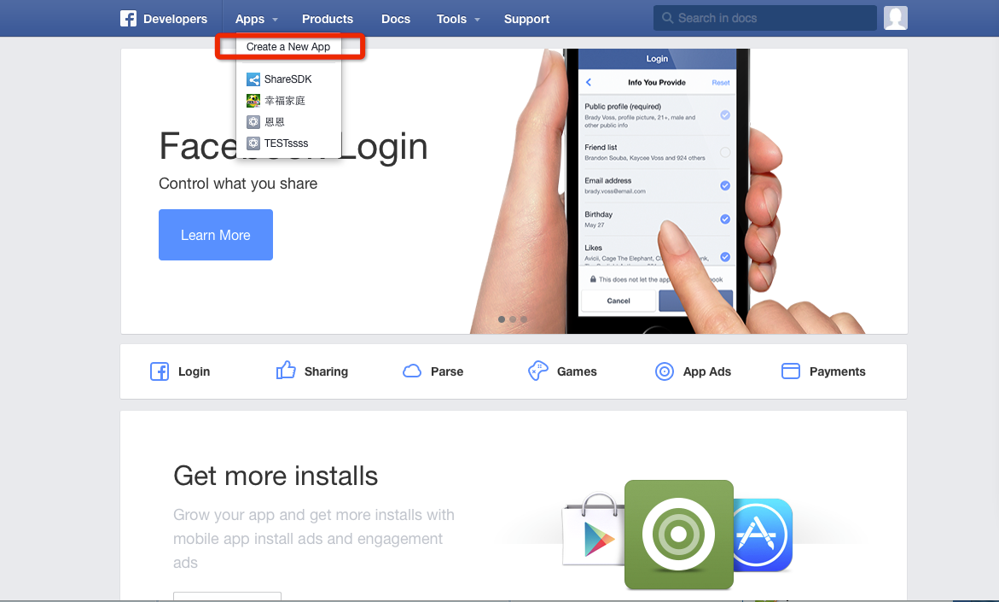
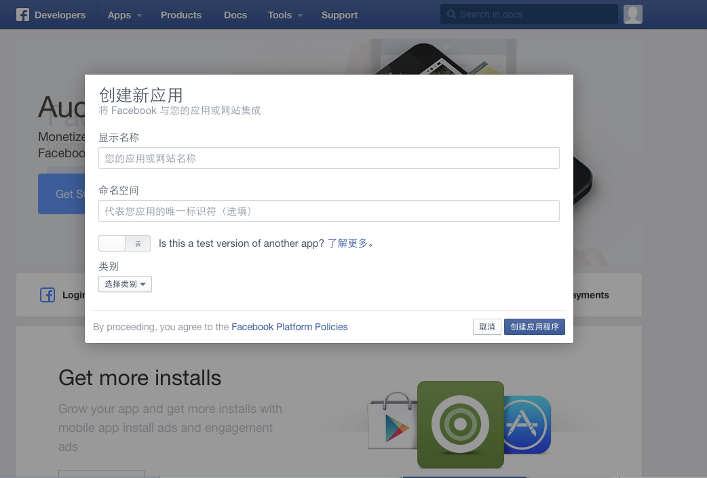
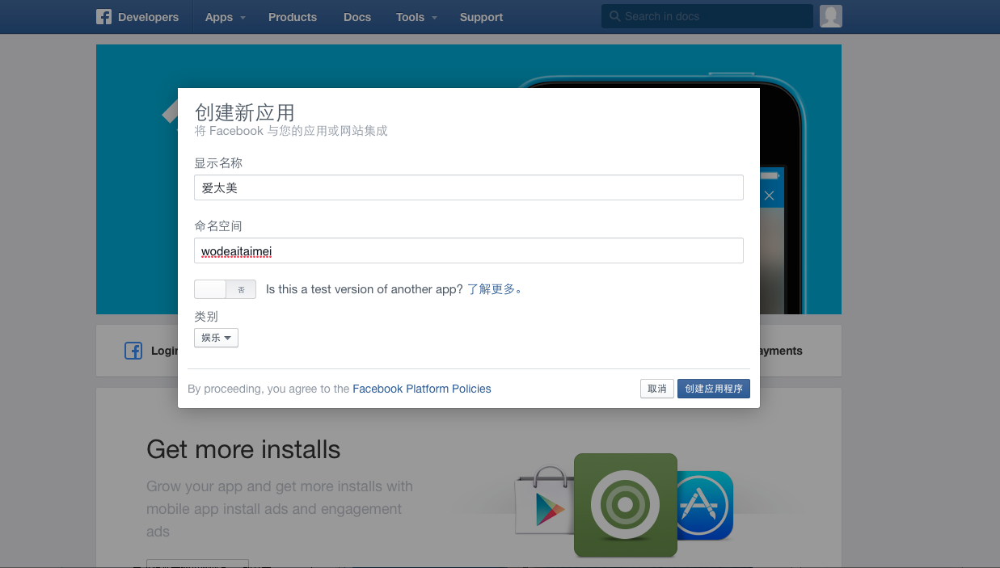
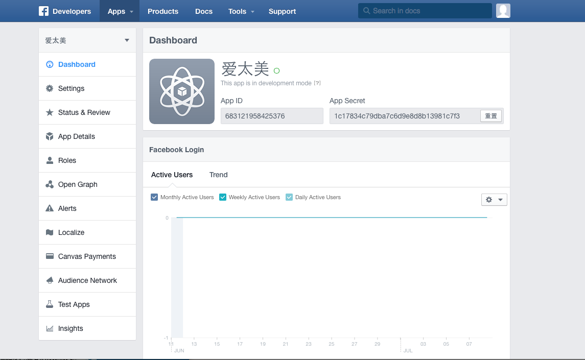
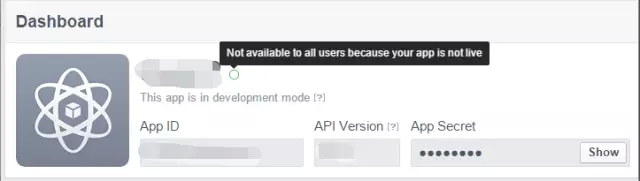
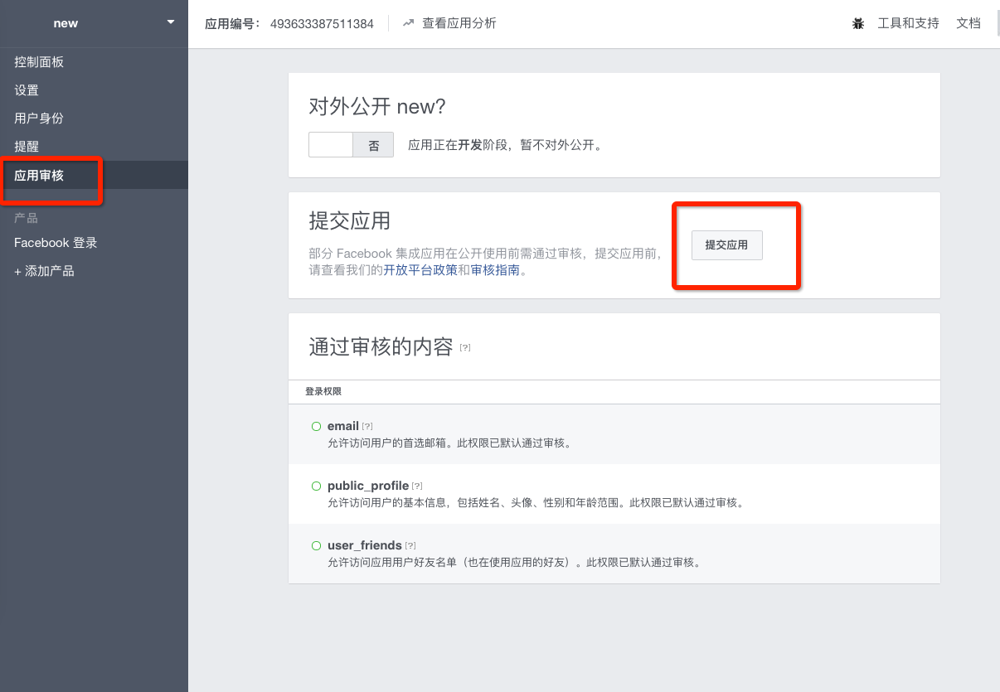

### 一、facebook api详细介绍  

1. 首先注册facebook账户  

2. 登录facebook的[开发者平台](https://developers.facebook.com)  

3. 将鼠标移到Apps的选项处，在弹出菜单中选择“Create a New App”，如图：  

   

4. 点击“Create a New App”如图：  

   

5. 填写应用相关信息后，点击创建应用程序：如图：  

   

6. 创建成功后，进入Dashboard选项。可以查看应用的App ID以及App Secret等信息（此信息在后续步骤中填入SDK中）  

   

### 接口例子  


```
componentWillMount(){
    axios.get("https://graph.facebook.com/me/?access_token=EAANF5R1JZCcwBAIC0WyTJOCWip8iNXj8yJOn7JVmPQdVlX85q8Jt8HY1oGAqskGiXr1Q8nZAIuhiqZAZAJoQdN82fzD1rjImHk62zcFZA5QANv2tZBJmo8ye9LWH6aAjpuxNlaFyhp5njZBPaVIiPlRQXZBGmpx8jaCdLdspw9p1BReTGZB7ml0iDgHOqFmlskYhW2QEDzKfxZCwZDZD",{})
    .then(res => console.log(res))
  }
```  

#### 注视：  

｀https://graph.facebook.com/me/?｀  

me可以换成自己的id  

id可以在开发者应用里面找到如图:  

   

应用授权后会形成一个token  


下面提供几个有趣的api  

好友列表 (Friends) https://graph.facebook.com/me/friends?access_token={token}

新闻 (News feed)https://graph.facebook.com/me/home?access_token={token}

用户喜好 (Likes)https://graph.facebook.com/me/likes?access_token={token}  

当然facebook还有很多api但是需要开发者去审核通过后才可以使用  

如图：  


