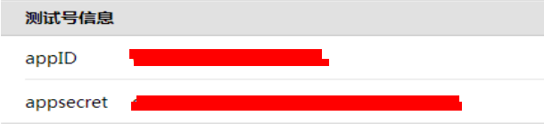
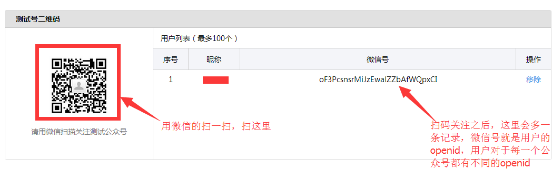
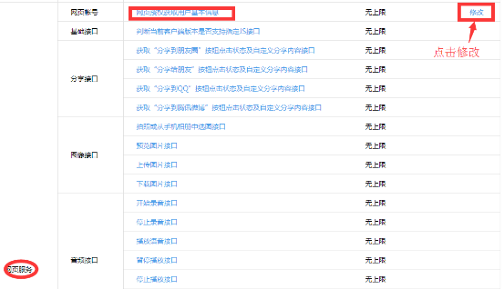
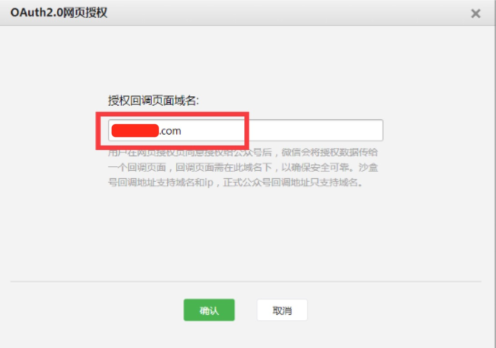
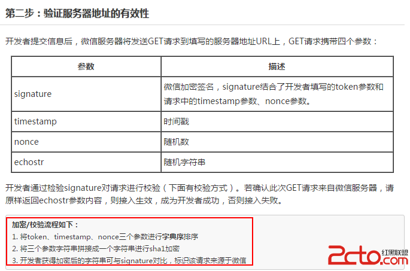
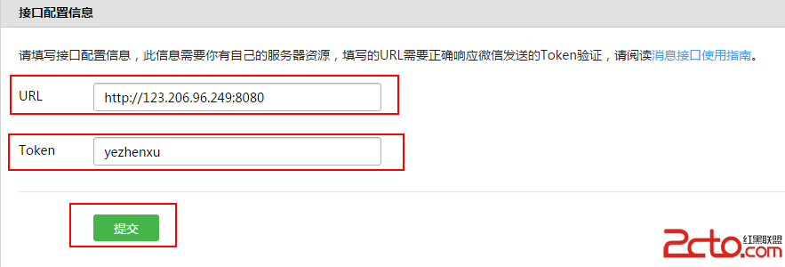
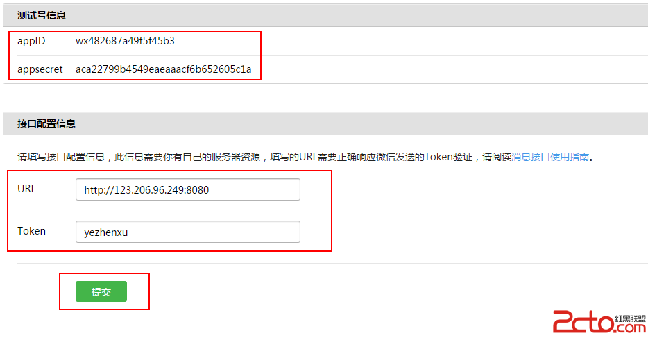

### 1、OAuth2.0简介  

OAuth（开放授权）是一个开放标准，允许用户让第三方应用访问该用户在某一网站上存储的私密的资源（如照片，视频，联系人列表），而无需将用户名和密码提供给第三方应用。  

允许用户提供一个令牌，而不是用户名和密码来访问他们存放在特定服务提供者的数据。每一个令牌授权一个特定的网站（例如，视频编辑网站)在特定的时段（例如，接下来的2小时内）内访问特定的资源（例如仅仅是某一相册中的视频）。这样，OAuth允许用户授权第三方网站访问他们存储在另外的服务提供者上的信息，而不需要分享他们的访问许可或他们数据的所有内容。我们这里主要模拟在微信公众号中使用OAuth2.0进行授权，获取用户的基本信息的过程。详细的开发文档可查看微信的官方文档。  

[微信公众平台开发者文档](http://mp.weixin.qq.com/wiki/14/89b871b5466b19b3efa4ada8e577d45e.html)  

### 2、获取测试公众账号及其相关配置  

1. 公众测试账号获取  

[访问上面的连接，选择“接口测试号申请”获得直接打开通过微信客户端扫码登录即可登录。](http://mp.weixin.qq.com/debug/cgi-bin/sandboxinfo?action=showinfo&t=sandbox/index)  

登录完即可获取到一个测试公众账号的信息。主要有appId和appsecret两个参数，这将唯一标示一个公众号，并且需要将他们作为参数获取用户的信息  

   

2. 关注公众号  

用户只有关注了这个公众号了，才能通过打开有公众号信息的链接去授权第三方登录，并获取用户信息的操作。故我们还需要用我们的微信关注微信号，操作如下：  

还是刚刚那个登录成功后跳转的页面，我们可以看到，该页面有一个二维码，我们可以通过扫描该二维码进行关注，关注成功在右边的“用户列表”会多一个用户的信息。如下图所示：  

   

3. 配置回调函数  

我们在微信客户端访问第三方网页（即我们自己的网页）的时候，我们可以通过微信网页授权机制，我们不仅要有前面获取到的appid和appsecret还需要有当用户授权之后，回调的域名设置，即用户授权后，页面会跳转到哪里。具体的配置如下：  

还是在刚刚的页面，有一个“网页授权获取用户基本信息”，点击后面的修改

   

填写回调的域名：  

   

如果你的网址没有被列入过黑名单，就会在顶部出现  

  

  

然后，域名配置就成功了！  

#### 注意：  

1. 这里填写的是域名（是一个字符串），而不是URL，因此请勿加http://等协议头；  

2. 授权回调域名配置规范为全域名，比如需要网页授权的域名为：www.qq.com，配置以后此域名下面的页面 http://www.qq.com/music.html 、 http://www.qq.com/login.html 都可以进行OAuth2.0鉴权。但 http://pay.qq.com 、 http://music.qq.com 、 http://qq.com无法进行OAuth2.0鉴权      

到这里，我们就获取到我们必须用到的测试信息了，包括  

公众号appID、appsecret的获取；  
关注我们测试的公众号；  
配置扫码用户授权后回调的域名。  

### 3、微信授权登录并获取用户基本信息  

微信授权使用的是OAuth2.0授权的方式。主要有以下简略步骤：  

第一步：用户同意授权，获取code

第二步：通过code换取网页授权access_token

第三步：刷新access_token（如果需要）

第四步：拉取用户信息(需scope为 snsapi_userinfo)  


#### 详细的步骤如下：  

1. 用户关注微信公众账号。  

2. 微信公众账号提供用户请求授权页面URL。  

3. 用户点击授权页面URL，将向服务器发起请求  

4. 服务器询问用户是否同意授权给微信公众账号(scope为snsapi_base时无此步骤)  

5. 用户同意(scope为snsapi_base时无此步骤)  

6. 服务器将CODE通过回调传给微信公众账号  

7. 微信公众账号获得CODE  

8. 微信公众账号通过CODE向服务器请求Access Token  

9. 服务器返回Access Token和OpenID给微信公众账号  

10. 微信公众账号通过Access Token向服务器请求用户信息(scope为snsapi_base时无此步骤)  

11. 服务器将用户信息回送给微信公众账号(scope为snsapi_base时无此步骤)  

### 代码操作  

    

我的理解如下：当开发者在测试号中配置点击提交后。微信服务器会发送一条GET请求到你所填写的服务器的地址上。  

GET请求携带四个参数(signature、timestamp、nonce、echostr)。  

服务器接收到GET请求，取出四个参数，然后进行如下操作：  

1. 将token (自己设置的) 、timestamp(时间戳)、nonce(随机数)三个参数进行字典排序  

2. 将上面三个字符串拼接成一个字符串再进行sha1加密  

3. 将加密后的字符串与signature进行对比，若成功，返回echostr  

  

在你的服务器上新建一个verifyURL.js文件，代码如下：  

```
ar PORT=8080; //监听8080端口号

var http=require('http');

var qs=require('qs');

var TOKEN='yezhenxu'; //必须与测试号所填写的Token相同

function checkSignature(params,token){

var key=[token,params.timestamp,params.nonce].sort().join('');

//将token (自己设置的) 、timestamp(时间戳)、nonce(随机数)三个参数进行字典排序

var sha1=require('crypto').createHash('sha1');

//将上面三个字符串拼接成一个字符串再进行sha1加密

sha1.update(key);

return sha1.digest('hex') ==params.signature;

//将加密后的字符串与signature进行对比，若成功，返回echostr

}

var server=http.createServer(function (request,response) {

var query=require('url').parse(request.url).query;

var params=qs.parse(query);

console.log(params);

console.log("token :",TOKEN);

if(!checkSignature(params,TOKEN)){

//如果签名不对，结束请求并返回

response.end('signature fail');

}

if (request.method == "GET") {

//如果请求是GET，返回echostr用于通过服务器有效校验

response.end(params.echostr);

}else{

//否则是微信给开发者服务器的POST请求

var postdata='';

request.addListener("data",function(postchunk){

postdata+=postchunk;

});

//获取到了POST数据

request.addListener("end",function(){

console.log(postdata);

response.end('success ');

});

}

});

server.listen(PORT, function () {

console.log('Server running at port:'+PORT);

});
```  

运行代码： node verifyURL.js (开启服务器)  

在你的测试号上填写服务器的配置(URL)  

    

点击提交，OK，大功告成!!!  

接下来，你就可以愉快地进行微信的开发之旅了……  
