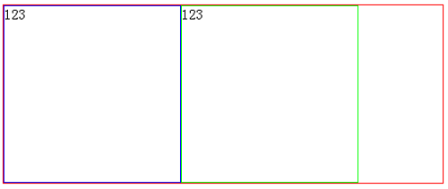

### clearfix的用法  

如果有一个DIV作为外部容器，内部的DIV如果设置了float样式，则外部的容器DIV因为内部没有 clear，导致不能被撑开。看下面的例子：  
Div布局如下：  
```
<body>
  <div class="box">
    <div class="box1"></div>
    <div class="box2"></div>
  </div>
</body>
```  

Css代码如下:  
```
.box{
  border: 1px solid  #f00;
  width: 500px;
}
.box1{
  width: 200px;
  height: 200px;
  float: left;
  border: 1px solid red;
}
.box2{
  width: 200px;
  height: 200px;
  float: left;
  border: 1px solid #00f;
}
```  
显示如下图：  

  

clearfix定义如下：  
```
.clearfix:before,
.clearfix:after {
  content: " "; /* 1 */
  display: table; /* 2 */
}
.clearfix:after {
  clear: both;
}
```
这样修改以后显示  

  

修改代码  

```
<body>
  <div class="box clearfix">
    <div class="box1"></div>
    <div class="box2"></div>
  </div>
</body>
```
