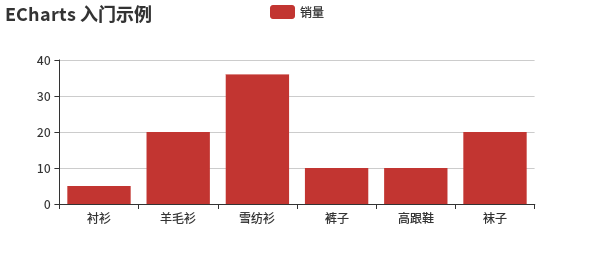

### ECharts 使用教程  

##### 获取 ECharts  

1. 从官网下载界面选择你需要的版本下载，根据开发者功能和体积上的需求，我们提供了不同打包的下载，如果你在体积上没有要求，可以直接下载完整版本。开发环境建议下载源代码版本，包含了常见的错误提示和警告。  
2. 在 ECharts 的 GitHub 上下载最新的 release 版本，解压出来的文件夹里的 dist 目录里可以找到最新版本的 echarts 库。
3. 通过 npm 获取 echarts，npm install echarts --save，详见“在 webpack 中使用 echarts”
4. cdn 引入，你可以在 cdnjs，npmcdn 或者国内的 bootcdn 上找到 ECharts 的最新版本。  

##### 引入 ECharts  

ECharts 3 开始不再强制使用 AMD 的方式按需引入，代码里也不再内置 AMD 加载器。因此引入方式简单了很多，只需要像普通的 JavaScript 库一样用 script 标签引入。  

```
<!DOCTYPE html>
<html>
<head>
    <meta charset="utf-8">
    <!-- 引入 ECharts 文件 -->
    <script src="http://cdn.bootcss.com/echarts/3.4.0/echarts.min.js"></script>
</head>
</html>
```  

##### 绘制一个简单的图表  

在绘图前我们需要为 ECharts 准备一个具备高宽的 DOM 容器。  

```
<body>
    <!-- 为 ECharts 准备一个具备大小（宽高）的 DOM -->
    <div id="main" style="width: 600px;height:400px;"></div>
</body>
```  

然后就可以通过 echarts.init 方法初始化一个 echarts 实例并通过 setOption 方法生成一个简单的柱状图，下面是完整代码。  

```
<!DOCTYPE html>
<html>
<head>
    <meta charset="utf-8">
    <title>ECharts</title>
    <!-- 引入 echarts.js -->
    <script src="echarts.min.js"></script>
</head>
<body>
    <!-- 为ECharts准备一个具备大小（宽高）的Dom -->
    <div id="main" style="width: 600px;height:400px;"></div>
    <script type="text/javascript">
        // 基于准备好的dom，初始化echarts实例
        var myChart = echarts.init(document.getElementById('main'));

        // 指定图表的配置项和数据
        var option = {
            title: {
                text: 'ECharts 入门示例'
            },
            tooltip: {},
            legend: {
                data:['销量']
            },
            xAxis: {
                data: ["衬衫","羊毛衫","雪纺衫","裤子","高跟鞋","袜子"]
            },
            yAxis: {},
            series: [{
                name: '销量',
                type: 'bar',
                data: [5, 20, 36, 10, 10, 20]
                }]
};
// 使用刚指定的配置项和数据显示图表。
       myChart.setOption(option);
   </script>
</body>
</html>
```

这样你的第一个图表就诞生了！  


